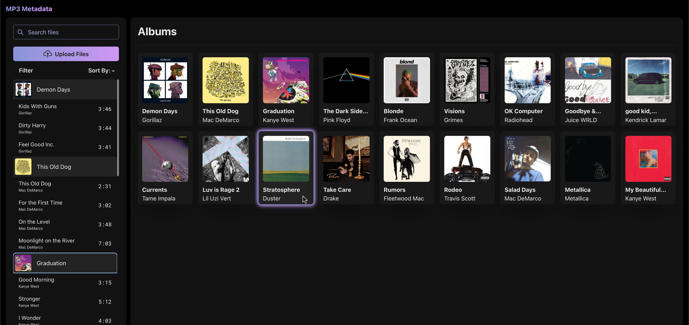

# Overview

MP3 Metadata is a project that aims to create a web-based version of common third party MP3 tagging applications.
Many first and third party metadata editors are clunky, buggy and/or not visually appealing.
Our goal with MP3 Metadata is to provide a platform for music enthusiasts who wish to customize their audio files, focusing on an appealing design and intuitive user experience.

## High-level Overview

The process begins when the user uploads an audio file to the website. 
During the upload process, the metadata is extracted and sent to a MySQL database for storage. 
Then, when the user wants to edit the metadata, a query is sent to the database to update the metadata in the Azure Blob Storage.
Finally, once a user is ready to download their file(s), the files are pulled from Azure and sent to the user's device.

## Frontend

The frontend is built using React, Chakra UI, and Next.js.
By keeping things simple, anyone can easily edit the metadata of their audio files without any prior knowledge of the process.

The main page of the website is the album view. 
By having uploaded songs displayed in an album format, users can choose to easily build their own albums, or edit individual songs.

From the main page, the user can either edit and download their albums/songs, or upload new files. 

When a user selects the album of their choice, they can view the current metadata of the album and the tracklist. 
From here, the user can edit the metadata of the album or individual tracks.

## Backend

The backend is built using MySQL, Prisma, and Azure Blob Storage, and deployed to Vercel.
The backend is responsible for storing, updating, and parsing files to display to the user.
A Blob Storage is used to accommodate larger audio files.

## Technologies

- TypeScript
- Next.js
- React
- Chakra UI
- MySQL
- Prisma
- Azure Blob

## Design Doc
To view the design document, click [here](https://exiledz5155.github.io/mp3-metadata-design-doc/).
